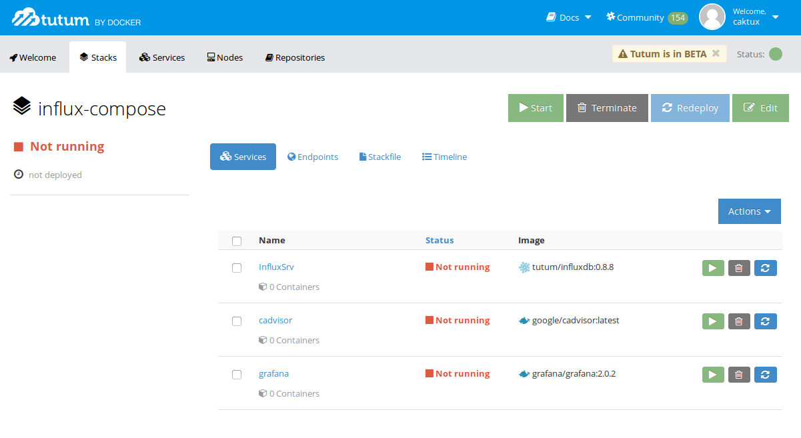
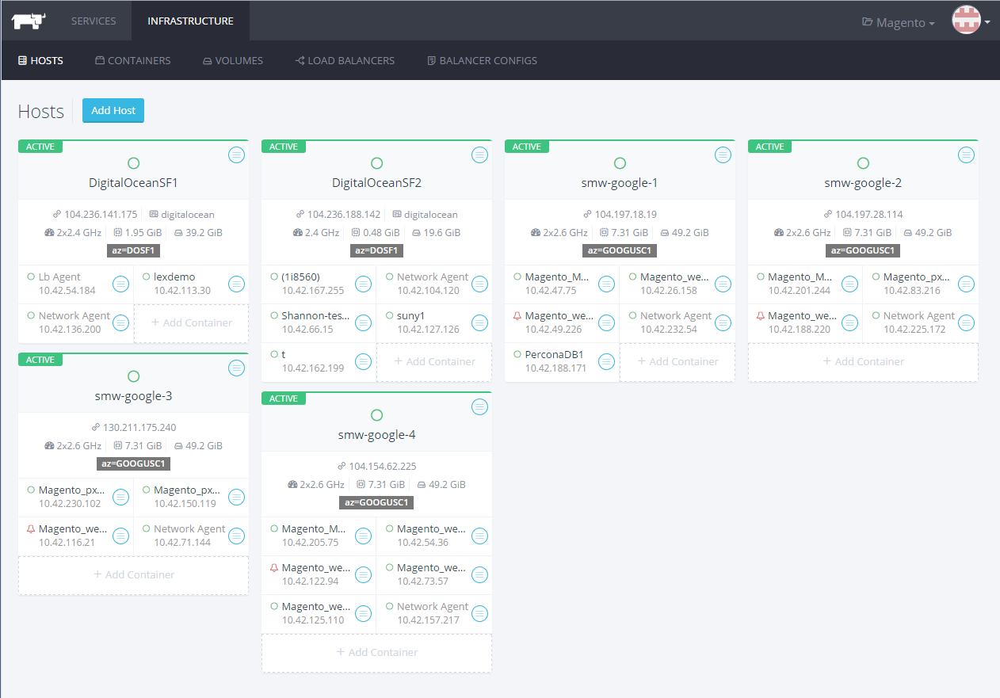

# Storm

```
$ storm deploy StormCluster [--production]
```
- Uses YAML config file for:
  - Available cloud providers
  - Number of instances per provider
  - Remote endpoint / domain name
- Deploys itself + Management UI and backend
  - Executed only once
  - `--production` is non-reversible / destroys local keys
  - Default configuration for self-deployment handles
    any number of instances
  - Discovery services on each instance
  - Pre-configures load balancing


- Management UI and backend
  - Accounts for Spokes (and eventually external users)
  - Dogfooding solves hosting the management infrastructure
  - Resource/billing limits set globally, per account and/or spread by groups
  - Launches clusters and containers
    - Control from UI or CLI tool
    - Cloud providers pre-configured from initial config
    - Choose allowed types of instances
    - Keep UI synced with cluster state
    - Built-in monitoring with cAdvisor+InfluxDB+Grafana
      - cAdvisor composed in each container
      - InfluxDB on backend receives monitoring data
      - Grafana dashboard to visualize container resource usage
      - Alerting (Kapacitor? Probably needs a more complete solution)

## Candidates / inspiration

### Tutum
<!--  -->


#### Pros
- Now part of the Docker family
- Simple and efficient UI
- Configurable Cloud Providers
- CLI tool (user+token)

#### Cons
- No groups / access control per account
- Hosted backend
- Unknown pricing once out of beta
- Huge image catalog but very generic / rarely scalable OOTB
- Clustering still difficult / requires as much manual work or more

### Rancher
<!--  -->


#### Pros
- Significant contributions to docker codebase (networking)
- Possible candidate for another acquisition (no source, nose says so)
- Great UI also, still comprehensive even with all the options (recently improved, screenshot is out-of-date)
- More focused on clustering and persistent storage solutions
- Self-hosted and open source
- Proper endpoint/access key/secret key model
- Very decent catalog of stacks and services
- External DNS services stacks
    - Sets <service>.<stack>.<environment>.<domain>

#### Cons
- Accounts but no groups / resource limits / management
- Cloud provider credentials per host / left to user to fill in
- Difficult automation / no one-line deployments
- Deployment of initial infra for backend seems problematic
- Java backend / management (but great CLI tools in Go!)

### Shared Cons
- No use of `docker-machine` nor `docker-swarm`
- `docker-compose.yml` files become Stacks or Stackfiles
  - Not a big issue as it's mostly just a naming thing
- Their CLI tools re-implement `docker-compose` for their platform

## Desired workflow

#### Initial backend/management deployment
```
$ storm deploy StormCluster
=====
Storm deployment (non-production)
=====
Hostname: devops.consensys.net
Instances:
  Azure: 3 (Medium)
  AWS: 1 (m3.medium)
  DigitalOcean: 1 (1GB)

Continue? [Y/n] Y

Launching instances ............. [ ok ]
Starting containers ............. [ ok ]
Setting up discovery services ... [ ok ]
Setting up load balancers ....... [ ok ]
Setting up DNS records .......... [ ok ]

Cluster ready, launching swarm...
[#########################                        ] 42%

Done!

Run `eval $(storm env StormCluster)` to point your CLI client to your new cluster.

Management UI will be available at https://devops.consensys.net after DNS propagation.
```
- One-time config for initialization with `storm config`
  - Securely sets master account credentials (preemptive 2FA possible?)
  - Securely sets Cloud provider credentials
  - DNS service configurations for user-launched clusters
- `storm env <name>` returns environment variables to point future `storm` calls
- Modeled after `docker-machine`, for `docker-machine`

#### First run configurations
- User accounts and groups (could be imported / generated during deploy)
- Resource limits
- Send invitations

## Basic CLI commands
```
$ storm status
Cluster health: OK (5/5)

$ storm available
Available resources:
25 Azure Medium    | 12 Azure Large
10 AWS m2.medium   | 5  AWS c4.large
5  DigitalOcean 1G | 2  DigitalOcean 2G

$ storm launch 1 Azure Medium unique_instance
Running pre-create checks...
Creating machine...
(unique_instance) Creating Azure Machine...
Waiting for machine to be running, this may take a few minutes...
Machine is running, waiting for SSH to be available...
Detecting operating system of created instance...
Detecting the provisioner...
Provisioning with ubuntu(systemd)...
Copying certs to the local machine directory...
Copying certs to the remote machine...
Setting Docker configuration on the remote daemon...
Checking connection to Docker...
Docker is up and running!
To see how to connect Docker to this machine, run: docker-machine env unique_instance

$ docker-machine env unique_instance
export DOCKER_TLS_VERIFY="1"
export DOCKER_HOST="tcp://unique_instance.cloudapp.net:2376"
export DOCKER_CERT_PATH="/home/user/.docker/machine/machines/unique_instance"
export DOCKER_MACHINE_NAME="unique_instance"
# Run this command to configure your shell:
# eval $(docker-machine env unique_instance)

$ eval $(docker-machine env unique_instance)

$ docker ps
CONTAINER ID   IMAGE   COMMAND   CREATED   STATUS   PORTS   NAMES

$ docker-machine ssh unique_instance
Welcome to Ubuntu 15.10 (GNU/Linux 4.2.0-18-generic x86_64)

 * Documentation:  https://help.ubuntu.com/

  Get cloud support with Ubuntu Advantage Cloud Guest:
    http://www.ubuntu.com/business/services/cloud


ubuntu@unique_instance:~$
```

## Clustering CLI commands
- Reads configurations from `storm.yml` file

```
$ storm deploy
Hostname: fauceth.consensys.net
Instances:
  Azure: 5 (Medium)
  AWS: 3 (m3.medium)
  DigitalOcean: 2 (1GB)

Continue? [Y/n] Y

Launching instances ............. [ ok ]
Starting containers ............. [ ok ]
Setting up discovery services ... [ ok ]
Setting up load balancers ....... [ ok ]
Setting up DNS records .......... [ ok ]

Cluster ready, launching swarm...
[#########################                        ] 42%

Done!

Run `eval $(storm env fauceth)` to point your CLI client to your new cluster.

Cluster will be available at https://fauceth.consensys.net after DNS propagation.

$ docker-machine ls
NAME                       ACTIVE   DRIVER   STATE     URL                                                SWARM       DOCKER   ERRORS
geth_node_0                -        azure    Running   tcp://geth_node_0.cloudapp.net:2376                geth_node_0 v1.9.1
geth_node_1                -        azure    Running   tcp://geth_node_1.cloudapp.net:2376                geth_node_0 v1.9.1
geth_node_2                -        azure    Running   tcp://geth_node_2.cloudapp.net:2376                geth_node_0 v1.9.1
geth_node_3                -        azure    Running   tcp://geth_node_3.cloudapp.net:2376                geth_node_0 v1.9.1
geth_node_4                -        azure    Running   tcp://geth_node_4.cloudapp.net:2376                geth_node_0 v1.9.1
geth_node_5                -        aws      Running   tcp://geth_node_5.awsapps.net:2376                 geth_node_0 v1.9.1
geth_node_6                -        aws      Running   tcp://geth_node_6.awsapps.net:2376                 geth_node_0 v1.9.1
geth_node_7                -        aws      Running   tcp://geth_node_7.awsapps.net:2376                 geth_node_0 v1.9.1
geth_node_8                -        do       Running   tcp://geth_node_8.do.net:2376                      geth_node_0 v1.9.1
geth_node_9                -        do       Running   tcp://geth_node_9.do.net:2376                      geth_node_0 v1.9.1
```
**FIXME** Show example of a real docker-machine swarm

## Possible `storm.yml` format
```yaml
Hostname: fauceth.consensys.net
Azure:
  - 5
  - Medium
AWS:
  - 3
  - m3.medium
DigitalOcean:
  - 2
  - 1G
compose:
  geth_cluster:
    file: docker-compose
    scale: 10
  cache_cluster:
    file: cluster-compose
    scale: 3
```

## Notes
- The main task of `storm` (besides abstracting `docker-machine --swarm`,
  automatic discovery and DNS setup...) is to transfer the certificates
  of launched instances back to the user, populating his
  `~/.docker/machine/machines` folder just like `docker-machine` would,
  but without the need for each cloud provider's credentials and keys,
  allowing resource management across an organization's or individual's
  cloud providers accounts.

  ```
  dockerized instance <-- (cert) docker-machine[storm] (cert) --> local
  ```

## Challenges
- Having to run discovery services for each cluster is tedious, needs
  to be built-in
  - Storm backend could provide that, so that only its cluster has to
    run discovery services on each host
  - Automatic on-all-instances might be viable too
- Same goes for load balancing
- Composing with persistent storage remains difficult
  - Provide application-specific solutions and good examples
    (ie. only need to find the right process once to pre-sync chain data)
  - One-click, pre-made configurations will solve the most popular use
    cases
    - Tutum and Rancher already are great starting points, but I'd rather
      see fewer, more robust, fully scalable stacks than too many
      only-good-for-a-one-host-demos

## Conclusion
Keeping the goals focused on simplicity and building on the current power of the docker tools
instead of re-implementing the basic features should allow for a simpler CLI tool to develop.
The combination of backend/management/UI/CLI still makes this a huge project overall,
even if at the core it's just a `docker-machine` wrapper...
